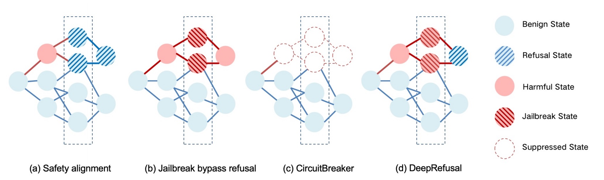

# DeepRefusal
*This work is built on [Refusal Direction](https://github.com/andyrdt/refusal_direction) and [CircuitBreaker](https://github.com/GraySwanAI/circuit-breakers/tree/main). Please refer to the corresponding repository for the code to obtain the refusal direction and output evaluation.*



We present DeepRefusal, a representation-engineering approach that rebuilds safety mechanisms inside large language models. During fine-tuning we probabilistically ablate the refusal direction across layers and token positions, forcing the model to reactivate its own refusal behavior after it has been disabled. Instead of relying on surface-level alignment, DeepRefusal trains the model to recover safe outputs even when internal representations are compromised. Across four open-source model families and six attack types, this internal-reconstruction strategy cuts attack-success rates by roughly 95 % while preserving downstream task performance, offering a practical path from shallow alignment to deep, self-repairing robustness.


# Citation
```
@inproceedings{xie2025beyond,
  title     = {Beyond Surface Alignment: Rebuilding {LLM}s Safety Mechanism via Probabilistically Ablating Refusal Direction},
  author    = {Yuanbo Xie and Yingjie Zhang and Tianyun Liu and Duohe Ma and Tingwen Liu},
  booktitle = {Findings of the Association for Computational Linguistics: {EMNLP} 2025},
  year      = {2025},
  publisher = {Association for Computational Linguistics},
  note      = {to appear}
}
```